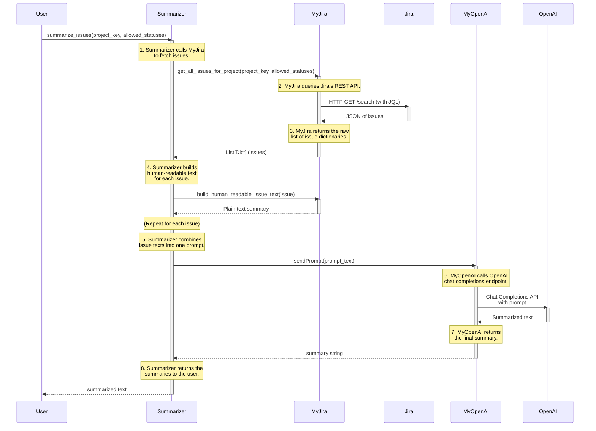

# jirastats

Grab stats and summaries from Jira

# Wut



# Install

python3 -m venv venv
source venv/bin/activate
pip3 install -r requirements.txt

# Settings

```
.env file should have
JIRA_API_TOKEN=
JIRA_USER=you@you.com
JIRA_CO_URL=your_org_name
JIRA_PROJECT=
OPENAI_API_KEY=
OPENAI_EMBEDDING_MODEL=text-embedding-3-small
OPENAI_USER=
OPENAI_COMPLETIONS_MODEL=o3-mini
```
